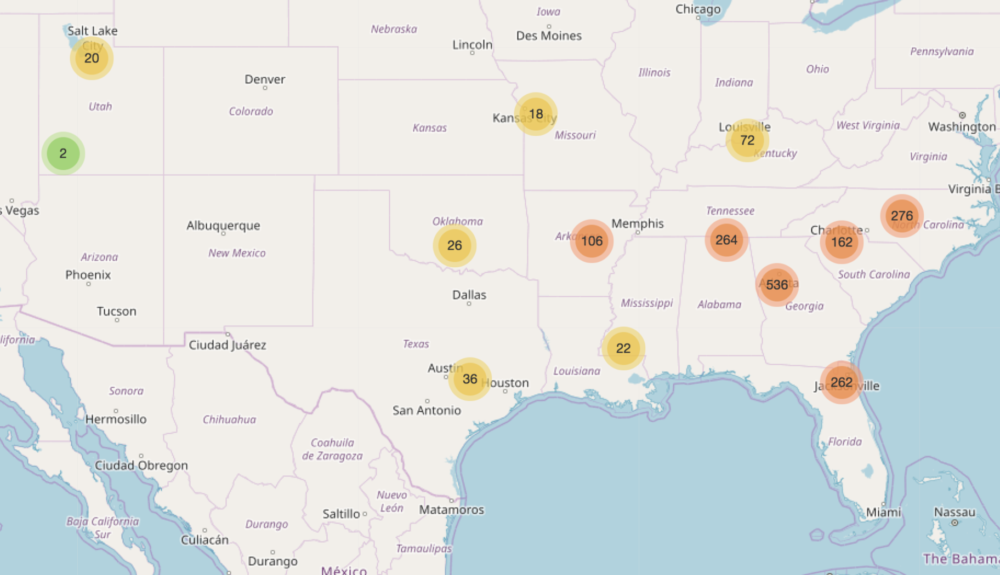

# zaxbys-map

Use Beautiful Soup to extract location information from [Zaxbys website]('https://www.zaxbys.com/locations/')

Use this [Google Maps Public api](https://maps.googleapis.com/maps/api/geocode/json?address=) to get latitude and longitude from zaxbys addresses that I got using beautiful soup. It is free but limited to a few hundred http calls per the day.

Use Folium python module to produce this beautiful map down below:

